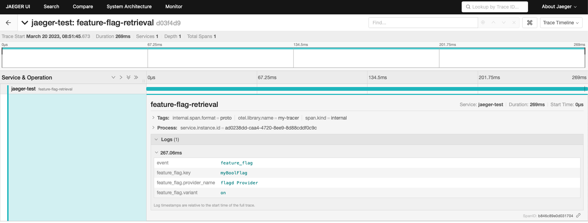
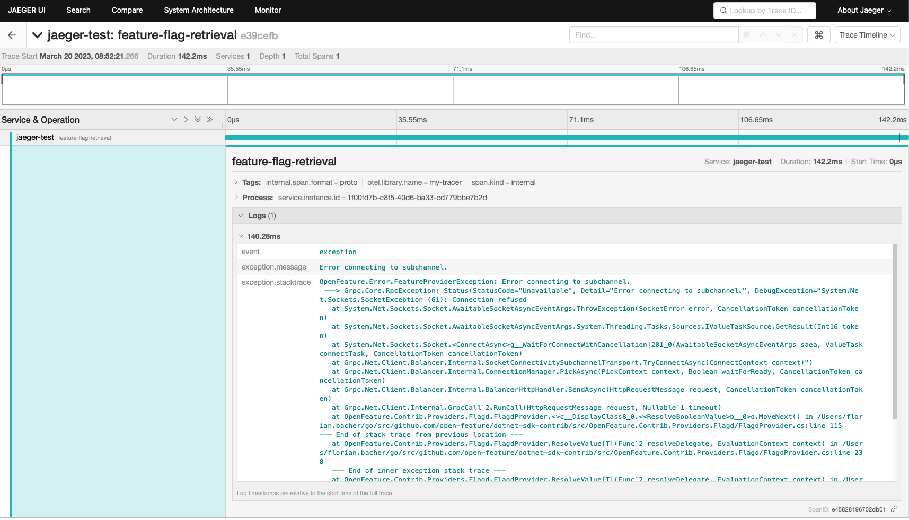

# OpenFeature OpenTelemetry hook for .NET

## Requirements

- open-feature/dotnet-sdk v1.5.0 > v2.0.0

## Usage - Traces

For this hook to function correctly a global `TracerProvider` must be set, an example of how to do this can be found below.

The `open telemetry hook` taps into the after and error methods of the hook lifecycle to write `events` and `attributes` to an existing `span`.
For this, an active span must be set in the `Tracer`, otherwise the hook will no-op.

### Example

The following example demonstrates the use of the `OpenTelemetry hook` with the `OpenFeature dotnet-sdk`. The traces are sent to a `jaeger` OTLP collector running at `localhost:4317`.

```csharp
using OpenFeature.Contrib.Providers.Flagd;
using OpenFeature.Contrib.Hooks.Otel;
using OpenTelemetry.Exporter;
using OpenTelemetry.Resources;
using OpenTelemetry;
using OpenTelemetry.Trace;

namespace OpenFeatureTestApp
{
    class Hello {
        static void Main(string[] args) {

			// set up the OpenTelemetry OTLP exporter
			var tracerProvider = Sdk.CreateTracerProviderBuilder()
                    .AddSource("my-tracer")
                    .ConfigureResource(r => r.AddService("jaeger-test"))
                    .AddOtlpExporter(o =>
                    {
                        o.ExportProcessorType = ExportProcessorType.Simple;
                    })
                    .Build();

			// add the Otel Hook to the OpenFeature instance
		    OpenFeature.Api.Instance.AddHooks(new TracingHook());

            var flagdProvider = new FlagdProvider(new Uri("http://localhost:8013"));

            // Set the flagdProvider as the provider for the OpenFeature SDK
            OpenFeature.Api.Instance.SetProvider(flagdProvider);

            var client = OpenFeature.Api.Instance.GetClient("my-app");

            var val = client.GetBooleanValueAsync("myBoolFlag", false, null);

            // Print the value of the 'myBoolFlag' feature flag
            System.Console.WriteLine(val.Result.ToString());
        }
    }
}
```

After running this example, you will be able to see the traces, including the events sent by the hook in your Jaeger UI:



In case something went wrong during a feature flag evaluation, you will see an event containing error details in the span:



## Usage - Metrics

For this hook to function correctly a global `MeterProvider` must be set.
`MetricsHook` performs metric collection by tapping into various hook stages.

Below are the metrics extracted by this hook and dimensions they carry:

| Metric key                             | Description                     | Unit         | Dimensions                          |
| -------------------------------------- | ------------------------------- | ------------ | ----------------------------------- |
| feature_flag.evaluation_requests_total | Number of evaluation requests   | {request}    | key, provider name                  |
| feature_flag.evaluation_success_total  | Flag evaluation successes       | {impression} | key, provider name, reason, variant |
| feature_flag.evaluation_error_total    | Flag evaluation errors          | Counter      | key, provider name                  |
| feature_flag.evaluation_active_count   | Active flag evaluations counter | Counter      | key                                 |

Consider the following code example for usage.

### Example

The following example demonstrates the use of the `OpenTelemetry hook` with the `OpenFeature dotnet-sdk`. The metrics are sent to the `console`.

```csharp
using OpenFeature.Contrib.Providers.Flagd;
using OpenFeature;
using OpenFeature.Contrib.Hooks.Otel;
using OpenTelemetry;
using OpenTelemetry.Metrics;

namespace OpenFeatureTestApp
{
    class Hello {
        static void Main(string[] args) {

            // set up the OpenTelemetry OTLP exporter
            var meterProvider = Sdk.CreateMeterProviderBuilder()
                    .AddMeter("OpenFeature.Contrib.Hooks.Otel")
                    .ConfigureResource(r => r.AddService("openfeature-test"))
                    .AddConsoleExporter()
                    .Build();

            // add the Otel Hook to the OpenFeature instance
            OpenFeature.Api.Instance.AddHooks(new MetricsHook());

            var flagdProvider = new FlagdProvider(new Uri("http://localhost:8013"));

            // Set the flagdProvider as the provider for the OpenFeature SDK
            OpenFeature.Api.Instance.SetProvider(flagdProvider);

            var client = OpenFeature.Api.Instance.GetClient("my-app");

            var val = client.GetBooleanValueAsync("myBoolFlag", false, null);

            // Print the value of the 'myBoolFlag' feature flag
            System.Console.WriteLine(val.Result.ToString());
        }
    }
}
```

After running this example, you should be able to see some metrics being generated into the console.

## License

Apache 2.0 - See [LICENSE](./../../LICENSE) for more information.
